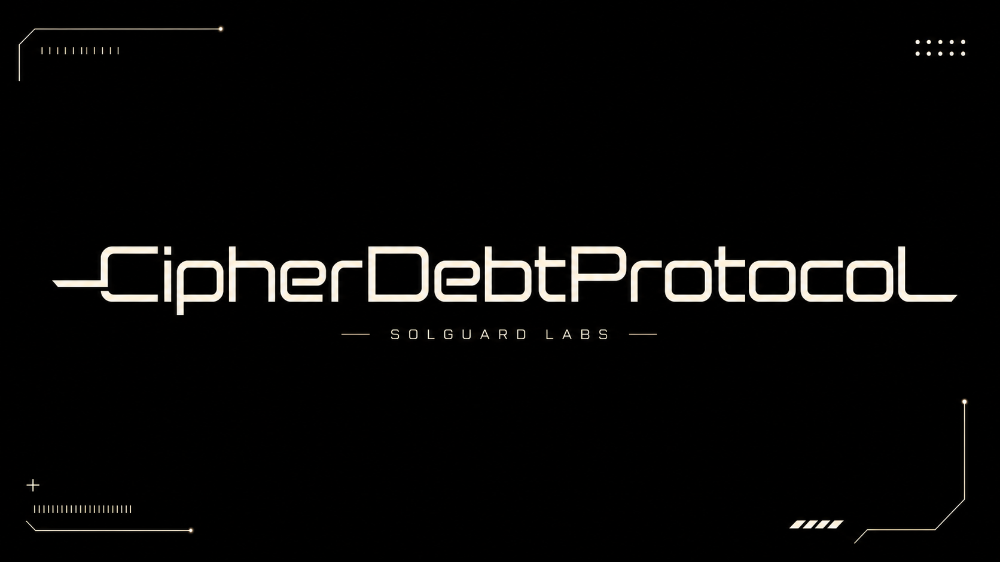
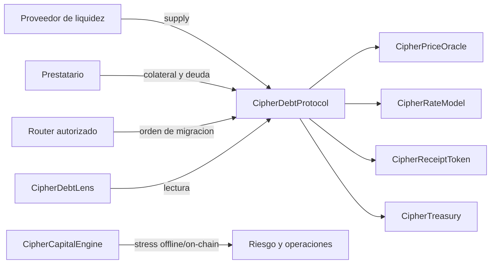
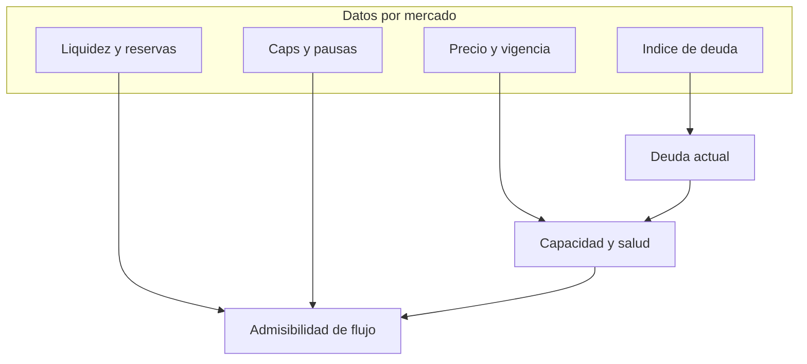
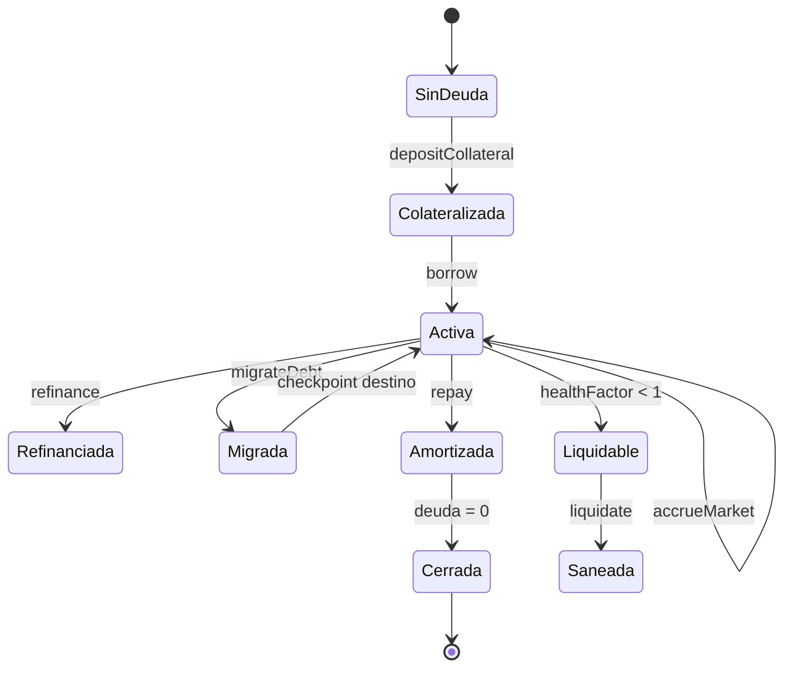
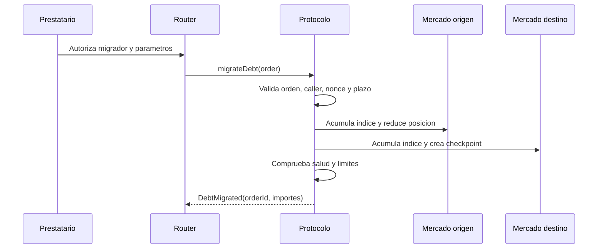
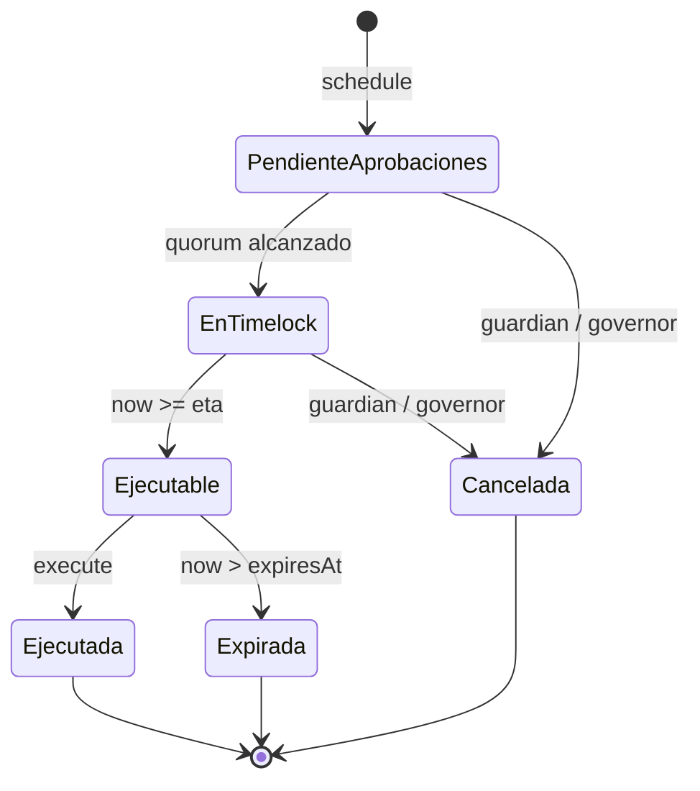
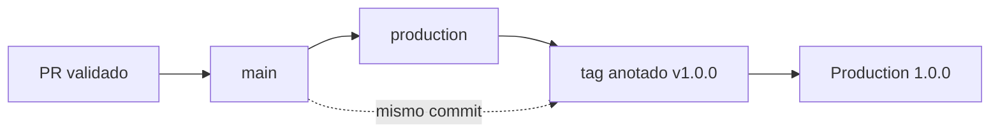

# CipherDebtProtocol



CipherDebtProtocol es una infraestructura EVM para originar, contabilizar y refinanciar
deuda sobregarantizada entre mercados internos. Cada mercado mantiene su propio activo,
colateral, indice de deuda, curva de tipos, liquidez, reservas y politica de liquidacion.
Las posiciones pueden amortizarse, refinanciarse o trasladarse entre mercados compatibles
mediante ordenes deterministas.

La entrega `Production 1.0.0` incluye contratos Solidity, un motor de capital bajo estres,
gobierno con quorum y timelock, SDK JavaScript con aritmetica entera, pruebas de integracion
y controles reproducibles para los artefactos publicados.

## Principios Del Sistema

- Contabilidad en enteros de 18 decimales, sin conversiones a coma flotante.
- Indices de deuda independientes por mercado y checkpoint por posicion.
- Colateral segregado por mercado, con umbral y factor de colateral explicitos.
- Oracles con vigencia, pausa y marca temporal verificables.
- Caps de suministro y deuda, suelo de posicion y pausas por flujo.
- Ordenes de migracion ligadas a prestatario, mercados, importe, plazo y nonce.
- Gobierno por operaciones canónicas con aprobaciones unicas, predecesores y expiracion.
- Modelo de capital que combina shocks, recuperacion, liquidez y concentracion.

## Arquitectura



El contrato principal es la unica superficie que mueve activos de mercado. El lens agrega
lecturas sin escribir estado. El motor de capital recibe exposiciones normalizadas y no
custodia fondos. El ejecutor de gobierno se despliega como autoridad separada y puede
convertirse en propietario de las superficies administrativas.



## Ciclo De Una Posicion



Una posicion almacena principal, indice de checkpoint, colateral y contadores operativos.
La deuda visible se obtiene proyectando el principal desde su indice hasta el indice
vigente del mercado. Las escrituras sensibles acumulan primero el mercado y despues
actualizan el checkpoint.

## Contabilidad De Deuda

Sea `I_t` el indice actual, `I_0` el indice de la posicion y `P_0` su principal:

```text
D_t = floor(P_0 * I_t / I_0)
```

El indice usa crecimiento lineal por segundo en cada intervalo de acumulacion:

```text
I_t = floor(I_prev * (WAD + ratePerSecond * elapsed) / WAD)
```

Los redondeos se hacen hacia abajo al cotizar y de forma explicita hacia arriba cuando se
calcula capital requerido. La documentacion de [contabilidad de deuda](./docs/debt-accounting.md)
detalla las unidades y checkpoints.

## Migracion Entre Mercados

Una orden contiene:

```solidity
struct MigrationOrder {
    address borrower;
    uint256 sourceMarketId;
    uint256 destinationMarketId;
    uint256 debtAmount;
    uint256 collateralAmount;
    uint256 destinationIndexSnapshot;
    uint256 minHealthFactor;
    uint256 deadline;
    uint256 nonce;
}
```

La ejecucion valida permiso del caller, plazo, nonce, compatibilidad de colateral, caps,
pausas, suelo de deuda y salud posterior en ambos mercados. El identificador de accion
liga la orden a la direccion del protocolo.



## Modelo Economico De Capital

`CipherCapitalEngine` evalua cada mercado con cinco transformaciones:

1. shock del valor de colateral;
2. shock del valor de deuda;
3. coste de liquidacion aplicado al valor protegido;
4. haircut sobre liquidez no comprometida;
5. objetivo de cobertura mas buffer operativo.

```text
stressedCollateral = collateralValue * (1 - collateralShock)
stressedDebt       = debtValue * (1 + debtShock)
liquidationValue   = stressedCollateral * threshold * (1 - liquidationCost)
liquidLiquidity    = freeLiquidity * (1 - liquidityHaircut)
requiredCapital    = ceil(stressedDebt * targetCoverage) + operationalBuffer
```

La agregacion calcula cobertura total, deficit por mercado, mayor participacion, HHI de
deuda y vencimiento medio ponderado. Consulte el [modelo economico](./docs/economic-model.md)
para un ejemplo completo.

## Gobierno

`CipherGovernanceExecutor` representa cada cambio como un identificador canonico que
incluye dominio de protocolo, `chainId`, ejecutor, target, valor, hash del calldata,
predecesor, salt, `eta` y expiracion.



Las aprobaciones son unicas por gobernador. Las operaciones con predecesor no pueden
ejecutarse hasta que la operacion anterior conste como ejecutada. Los cambios de quorum,
delay, guardian y conjunto de gobernadores requieren una llamada del propio ejecutor.

## SDK JavaScript

El SDK de `sdk/cipherDebtClient.js` proporciona:

- construccion de ordenes con valores `uint256` serializados como decimales;
- tipos EIP-712 para integraciones de firma;
- aritmetica `mulDivDown` y `mulDivUp` con `bigint`;
- modelo de capital equivalente al contrato;
- cliente HTTP con HTTPS obligatorio fuera de localhost;
- timeout, rechazo de redirects, `Content-Type` estricto, bearer token e idempotencia.

```javascript
const { CipherDebtClient, WAD } = require("./sdk/cipherDebtClient");

const client = new CipherDebtClient({
    baseUrl: "https://api.cipher.example",
    bearerToken: process.env.CIPHER_API_TOKEN,
});

const preview = await client.previewMigration({
    borrower: "0x1111111111111111111111111111111111111111",
    sourceMarketId: 4n,
    destinationMarketId: 8n,
    debtAmount: 125n * WAD,
    collateralAmount: 250n * WAD,
    destinationIndexSnapshot: WAD,
    minHealthFactor: WAD,
    deadline: 2_000_000_000n,
    nonce: 44n,
});
```

La referencia completa esta en [docs/sdk.md](./docs/sdk.md).

## Estructura Del Repositorio

```text
.
|-- .github/                 CI, integridad de release y ownership
|-- assets/                  identidad visual
|-- docs/                    documentacion de arquitectura y operacion
|-- scripts/                 verificadores y entradas reproducibles
|-- sdk/                     cliente JavaScript y modelo offline
|-- src/
|   |-- CipherDebtProtocol.sol
|   |-- governance/          catalogo y ejecutor con timelock
|   |-- interest/            curva e indice de deuda
|   |-- lens/                consultas agregadas
|   |-- libraries/           matematicas y contabilidad
|   |-- oracle/              precios y vigencia
|   |-- risk/                capital y concentracion
|   |-- tokens/              activos y recibos
|   `-- treasury/            reservas operativas
|-- test/                    pruebas Hardhat de contratos
`-- tests/node/              pruebas de SDK y artefactos
```

## Requisitos

- Node.js 24.
- npm 11 o compatible con lockfile v3.
- Git.

No se requieren dependencias Solidity de runtime. Hardhat descarga el compilador fijado
en `0.8.24` durante la primera compilacion.

## Instalacion Y Validacion

```bash
npm ci
npm run ci
```

La orden completa limpia artefactos, compila, ejecuta pruebas Hardhat y Node, comprueba
formato y verifica inventario documental, banner, metadatos y ausencia de material privado
versionado.

Comandos individuales:

```bash
npm run compile
npm test
npm run test:node
npm run lint
npm run verify
```

## Entrega Y Referencias

La entrega estable sigue esta relacion:



El workflow `release-integrity` exige que `main`, `production` y el objeto pelado del tag
apunten al mismo commit. En el evento de release tambien valida nombre, estado draft y
estado prerelease.

## Documentacion

| Documento                                       | Contenido                                 |
| ----------------------------------------------- | ----------------------------------------- |
| [Arquitectura](./docs/architecture.md)          | Componentes, trust boundaries y flujos    |
| [Contabilidad](./docs/debt-accounting.md)       | Indices, checkpoints, interes y redondeo  |
| [Modelo economico](./docs/economic-model.md)    | Capital, shocks, liquidez, HHI y ejemplos |
| [Gobierno](./docs/governance.md)                | Identidad de operacion, quorum y timelock |
| [Operaciones](./docs/operations.md)             | Despliegue, observabilidad e incidentes   |
| [SDK](./docs/sdk.md)                            | Cliente, ordenes, transporte y errores    |
| [Modelo de seguridad](./docs/security-model.md) | Activos, limites, amenazas y controles    |

## Seguridad

La politica de comunicacion, alcance, severidad y respuesta coordinada se encuentra en
[SECURITY.md](./SECURITY.md). No incluya secretos, claves, frases semilla ni datos de
terceros en issues o trazas.

## Licencia

MIT. Consulte [LICENSE](./LICENSE).
