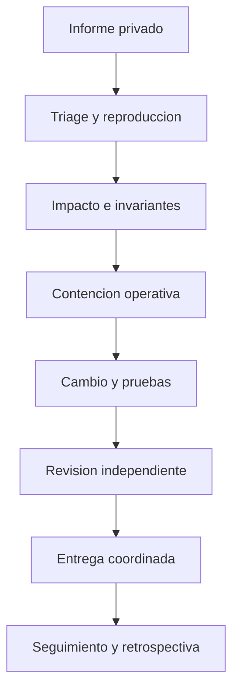

# Politica De Seguridad

CipherDebtProtocol recibe y gestiona informes de seguridad mediante un proceso privado,
reproducible y coordinado. Esta politica cubre la entrega `Production 1.0.0` y las ramas
`main` y `production` cuando resuelven al commit publicado.

## Versiones Mantenidas

| Referencia         | Estado              | Observacion                        |
| ------------------ | ------------------- | ---------------------------------- |
| `Production 1.0.0` | Mantenida           | Release estable                    |
| `production`       | Mantenida           | Debe coincidir con el tag estable  |
| `main`             | Mantenida           | Integracion validada               |
| Otras ramas        | Evaluacion limitada | No representan una entrega estable |

## Alcance

Se consideran dentro de alcance:

- movimientos de activos, colateral y reservas;
- contabilidad de deuda, indices y checkpoints;
- suministro, prestamo, repayment, refinanciacion y migracion;
- liquidaciones, factores de salud y limites de mercado;
- oracle, vigencia de precios y pausas;
- roles, ownership, quorum, timelock y guardian;
- motor de capital, concentracion y liquidez;
- SDK, serializacion de importes e idempotencia;
- workflows que publican o verifican una entrega.

Quedan normalmente fuera de alcance:

- forks o despliegues modificados por terceros;
- disponibilidad de proveedores externos sin efecto sobre activos o contabilidad;
- credenciales obtenidas fuera de los sistemas mantenidos;
- interfaces no incluidas en este repositorio;
- configuraciones que contradigan explicitamente los limites documentados.

## Invariantes De Seguridad

Las revisiones deben razonar, como minimo, sobre estas propiedades:

1. cada salida de activo tiene un cambio contable asociado;
2. una posicion con deuda no puede retirar colateral por debajo del umbral;
3. la deuda de posicion y la deuda agregada evolucionan con el mismo indice;
4. una orden consumida no puede volver a ejecutarse;
5. los mercados origen y destino deben conservar compatibilidad de colateral;
6. caps, pausas y suelo de deuda se comprueban antes de completar el flujo;
7. una operacion de gobierno no puede eludir quorum, delay, predecesor o expiracion;
8. `main`, `production` y `v1.0.0` deben identificar exactamente el mismo commit.

## Como Informar

Use el canal privado designado por los mantenedores. No publique detalles tecnicos en
issues, discusiones o redes sociales antes de acordar una respuesta.

Incluya:

- referencia exacta: commit, rama o tag;
- componente y funcion afectada;
- precondiciones y permisos necesarios;
- secuencia minima reproducible;
- comportamiento esperado y observado;
- efecto economico con unidades y redondeos;
- logs, transacciones o prueba automatizada;
- propuesta de contencion si existe.

No envie claves privadas, frases semilla, tokens de acceso ni datos personales. Sustituya
direcciones sensibles por identificadores controlados y use una red local para cualquier
reproduccion que mueva activos simulados.

## Clasificacion

La prioridad considera simultaneamente:

- valor economicamente expuesto;
- ausencia o presencia de permisos privilegiados;
- alcance entre cuentas o mercados;
- repetibilidad y automatizacion;
- capacidad de retirar activos o crear deficit;
- controles operativos disponibles;
- complejidad de recuperacion.

Una discrepancia puramente informativa sin transicion economica se trata de forma distinta
a una ruta que altere deuda, reservas, colateral o propiedad de activos.

## Respuesta Coordinada

Objetivos operativos:

| Fase                    |  Objetivo inicial |
| ----------------------- | ----------------: |
| Acuse de recibo         | 2 dias laborables |
| Triage tecnico          | 5 dias laborables |
| Evaluacion economica    | 7 dias laborables |
| Actualizacion de estado |           Semanal |

Los plazos pueden cambiar por complejidad, necesidad de coordinacion o impacto. El equipo
mantendra al informante al corriente de cambios materiales y acordara el contenido de una
comunicacion posterior.

## Contencion

Segun el flujo afectado, las medidas disponibles incluyen:

- pausa global;
- pausa de borrow, repay, migracion o liquidacion por mercado;
- reduccion de caps;
- retirada de permisos de migrador;
- actualizacion de parametros de oracle o riesgo;
- cancelacion de operaciones de gobierno pendientes;
- rotacion de guardian o gobernadores mediante el timelock.

La contencion no sustituye la reconciliacion contable. Toda respuesta debe verificar
posiciones, deuda agregada, liquidez, reservas y eventos antes de reabrir el flujo.

## Investigacion Responsable

- Trabaje sobre redes locales o entornos propios.
- No acceda a activos, cuentas ni datos de terceros.
- No degrade servicios ni fuerce indisponibilidad.
- Detenga la prueba si aparece un efecto fuera del alcance controlado.
- Preserve hashes, bloques, timestamps y versiones de herramientas.
- Comparta solo el minimo material necesario por canales privados.

## Cierre

Una correccion se considera preparada cuando:

- existe una prueba que falla antes y pasa despues;
- las invariantes economicas relevantes quedan verificadas;
- la suite completa pasa en Ubuntu y Windows;
- el cambio ha sido revisado;
- las referencias de produccion coinciden;
- existe un plan de despliegue, observacion y, si procede, rollback.

El reconocimiento publico se coordinara con la persona informante cuando lo solicite y
resulte apropiado.
