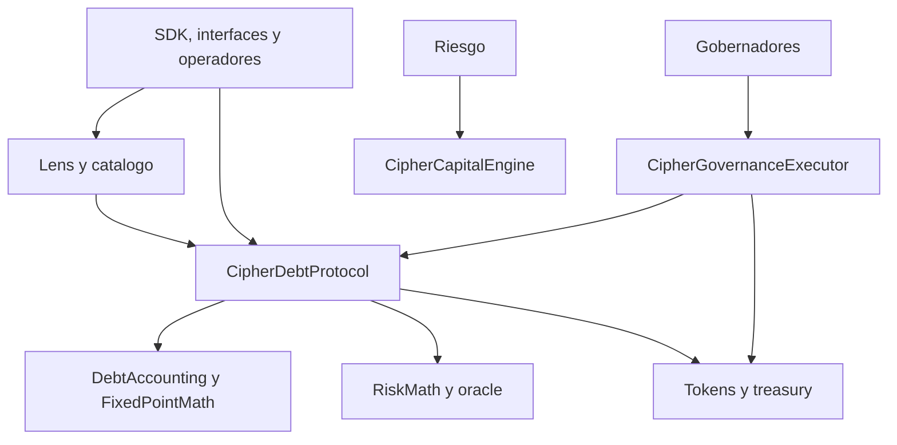
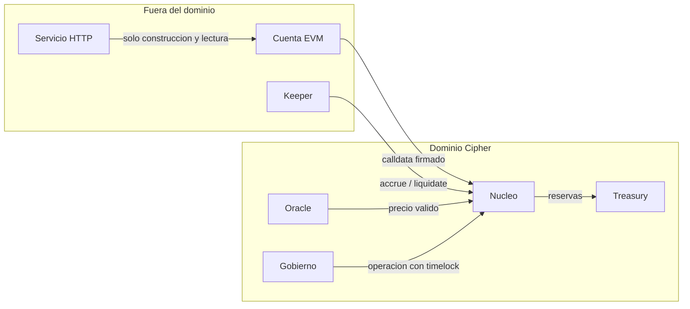

# Arquitectura

## Objetivo

CipherDebtProtocol separa custodia, contabilidad, lectura, gobierno y analisis de riesgo.
El nucleo conserva el estado economico; el resto de componentes consume superficies
estrechas y verificables. Esta separacion permite revisar de forma independiente el
movimiento de activos y los calculos auxiliares.

## Componentes

| Componente                 | Responsabilidad                                      | Escribe estado economico |
| -------------------------- | ---------------------------------------------------- | ------------------------ |
| `CipherDebtProtocol`       | Mercados, posiciones, deuda, colateral y liquidacion | Si                       |
| `CipherPriceOracle`        | Precio, timestamp, vigencia y pausa                  | No                       |
| `CipherRateModel`          | Curva de tipo por utilizacion                        | No                       |
| `CipherReceiptToken`       | Representacion de suministro                         | Si, mediante el nucleo   |
| `CipherTreasury`           | Reservas y pagos operativos                          | Si, con roles            |
| `CipherDebtLens`           | Lecturas agregadas y previews                        | No                       |
| `CipherMarketCatalog`      | Metadatos y limites de operacion                     | No sobre posiciones      |
| `CipherCapitalEngine`      | Stress de capital, liquidez y concentracion          | No                       |
| `CipherGovernanceExecutor` | Quorum, timelock y ejecucion administrativa          | Solo gobierno            |

## Capas

La superficie de lectura puede fallar sin impedir repayment. El motor de capital no tiene
permisos sobre fondos. El ejecutor de gobierno puede llamar a componentes administrativos,
pero solo despues de una operacion identificada, aprobada y madura.

## Limites De Confianza

El SDK no se considera una fuente de verdad. Todas las condiciones decisivas vuelven a
evaluarse en contrato. El oracle es una dependencia de riesgo: precio cero, expirado o
pausado no debe convertirse en una cotizacion utilizable.

## Estado Por Mercado

Cada mercado agrupa:

- activo prestable y activo de colateral;
- token de recibo;
- liquidez suministrada, deuda total y reservas;
- indice de deuda y timestamp de ultima acumulacion;
- tasa por segundo;
- factores de colateral, liquidacion, bonificacion y reserva;
- caps, suelo de deuda y flags de pausa.

Las posiciones se indexan por `(marketId, account)` y mantienen principal, indice de
checkpoint, colateral, contadores de migracion/liquidacion y timestamps de actividad.

## Escritura De Una Operacion

El orden general para una accion con deuda es:

1. validar mercado y pausa global;
2. acumular el indice del mercado;
3. leer la deuda de posicion al indice actualizado;
4. calcular el siguiente estado en memoria;
5. aplicar caps, suelo y salud;
6. escribir checkpoint y agregados;
7. mover activos;
8. emitir un evento con identificadores e importes.

La proteccion de reentrada cubre las rutas que transfieren ERC-20. Las librerias de
transferencia exigen retorno correcto o ausencia de retorno, y revierten ante llamadas
fallidas.

## Lecturas Y Observabilidad

`CipherDebtLens` pagina mercados, resume posiciones, calcula utilizacion, prepara previews
y ordena mercados. Un indexador debe tratar estas lecturas como una vista del bloque
consultado y registrar siempre `chainId`, direccion, bloque y hash.

Eventos minimos para reconstruccion:

- creacion y configuracion de mercado;
- suministro y retirada;
- deposito y retirada de colateral;
- borrow, repayment y refinanciacion;
- migracion y liquidacion;
- acumulacion de indice;
- cambios de roles, pausas y gobierno.

## Despliegue Recomendado

1. desplegar activos, oracle y treasury;
2. desplegar el nucleo con owner temporal controlado;
3. crear mercados con caps conservadores;
4. desplegar lens, catalogo, motor de capital y ejecutor;
5. validar direcciones, bytecode y parametros;
6. transferir ownership al ejecutor;
7. aceptar ownership mediante una operacion gobernada;
8. habilitar flujos por etapas y observar invariantes.

No se debe reutilizar un dominio de gobierno entre cadenas o instancias. El `chainId`, la
direccion del ejecutor y el dominio de protocolo forman parte de cada identidad de
operacion.
