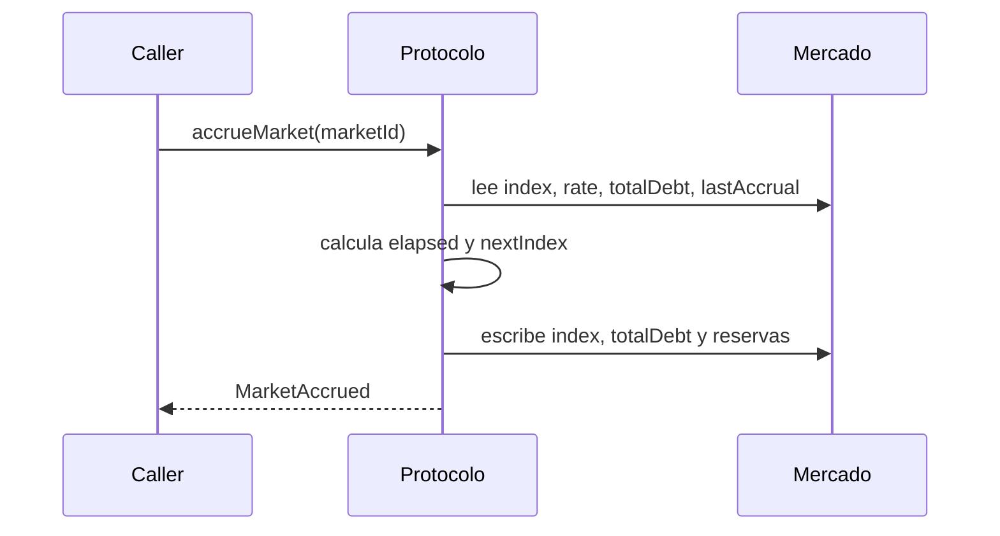
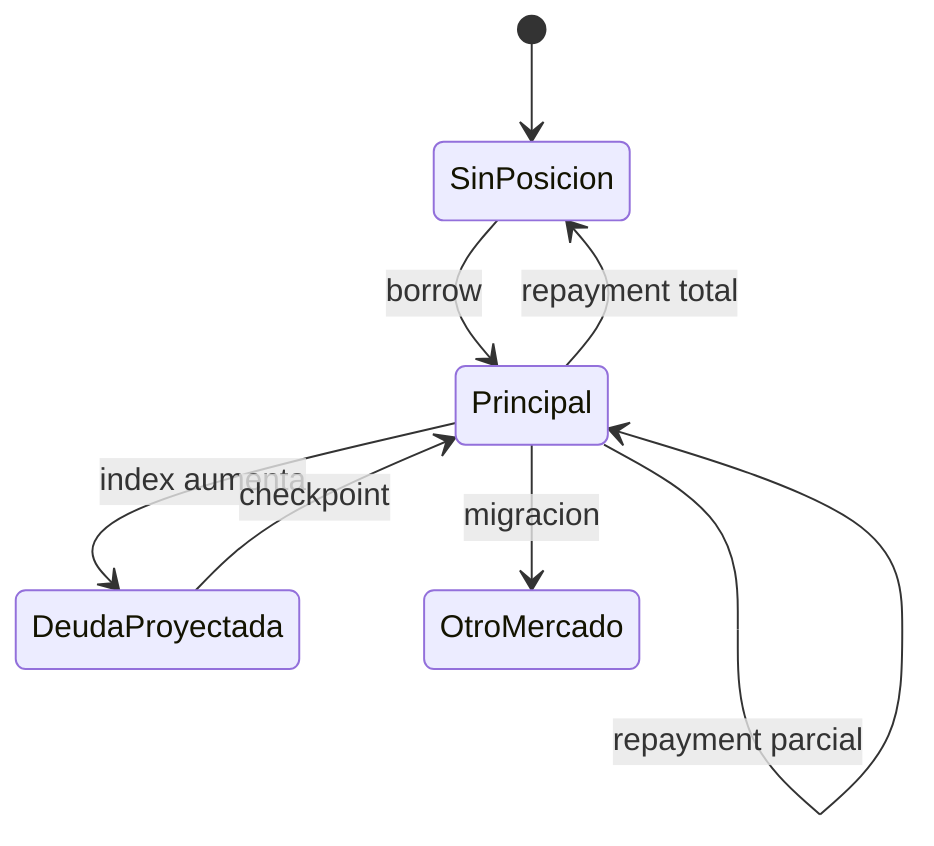

# Contabilidad De Deuda E Indices

## Unidades

El protocolo usa enteros sin signo. Los importes de tokens se expresan en las unidades
del activo; precios, indices, factores y salud se normalizan a `WAD = 10^18`.

| Magnitud          | Unidad                | Redondeo habitual |
| ----------------- | --------------------- | ----------------- |
| Principal         | Unidades del activo   | Exacto            |
| Indice            | WAD                   | Hacia abajo       |
| Precio            | WAD                   | Fuente del oracle |
| Factor de salud   | WAD                   | Hacia abajo       |
| Capital requerido | Unidades normalizadas | Hacia arriba      |

## Indice De Mercado

Para un intervalo de `elapsed` segundos:

```text
growth = WAD + ratePerSecond * elapsed
nextIndex = floor(previousIndex * growth / WAD)
```

La deuda agregada evoluciona con la misma razon:

```text
nextTotalDebt = floor(previousTotalDebt * nextIndex / previousIndex)
interestAccrued = nextTotalDebt - previousTotalDebt
reserveAccrued = floor(interestAccrued * reserveFactor / WAD)
```



Si no existe deuda o no ha transcurrido tiempo, el indice no cambia. Esta regla evita
crear interes sin exposicion.

## Checkpoint De Posicion

Una posicion guarda `(principal, indexSnapshot)`. Su deuda al indice `currentIndex` es:

```text
currentDebt = floor(principal * currentIndex / indexSnapshot)
```

Cuando cambia la deuda, se escribe:

```text
principal = nextDebt
indexSnapshot = currentIndex
```

Este checkpoint materializa en el principal todos los intereses acumulados hasta el
bloque actual. A partir de ahi solo se acumula la variacion posterior del indice.

## Cambios De Deuda



En un borrow se suma principal al indice vigente. En un repayment se limita el pago a la
deuda actual. En una liquidacion se reduce deuda y colateral dentro de la posicion del
prestatario. El suelo de deuda evita residuos positivos por debajo de `minDebt`.

## Deuda Y Salud

Con precio de colateral `P_c`, precio de deuda `P_d`, colateral `C`, deuda `D` y umbral
`L`:

```text
collateralValue = floor(C * P_c / WAD)
debtValue = floor(D * P_d / WAD)
protectedValue = floor(collateralValue * L / WAD)
healthFactor = floor(protectedValue * WAD / debtValue)
```

`healthFactor >= WAD` mantiene la posicion fuera de liquidacion. Para borrow se usa
ademas el factor de colateral, normalmente inferior al umbral de liquidacion.

## Ejemplo

Parametros:

```text
principal inicial      = 1,000.000000
indice de checkpoint   = 1.000000
indice actual          = 1.094608
precio deuda           = 1.000000
colateral              = 1,000.000000
precio colateral       = 2.000000
umbral liquidacion     = 0.750000
```

Resultado:

```text
deuda actual           = 1,094.608000
valor protegido        = 1,500.000000
factor de salud        = 1.370354...
```

Los ejemplos de integracion deben mantener valores como `bigint`. Convertir un `uint256`
a `Number` puede perder precision por encima de `2^53 - 1`.

## Migracion

La migracion acumula origen y destino antes de tocar posiciones. El origen calcula la
deuda actual y limita el importe solicitado. El destino crea un nuevo checkpoint al
indice vigente. La orden incluye snapshot, minHealth, deadline y nonce como parametros
economicos y operativos.

Un reconciliador debe registrar, por evento:

- deuda liberada en origen;
- deuda contabilizada en destino;
- colateral trasladado;
- indices de ambos mercados en el bloque;
- deuda total antes y despues;
- salud final de ambas posiciones.

## Reglas De Redondeo

- Use `mulWad` para cotizaciones conservadoras hacia abajo.
- Use `mulWadUp` cuando una obligacion minima no pueda quedar infravalorada.
- No combine cantidades de tokens con distinta precision sin normalizar.
- Compare con tolerancia solo cuando la fuente de redondeo este identificada.
- No use tolerancia para ocultar una diferencia que crece con el principal.

Las pruebas deben cubrir valores de un wei, importes cercanos a caps, indices altos,
intervalos largos y repayment que deje exactamente cero o exactamente `minDebt`.
