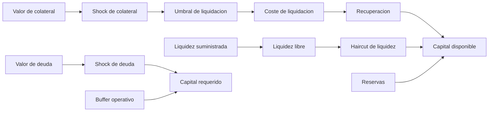
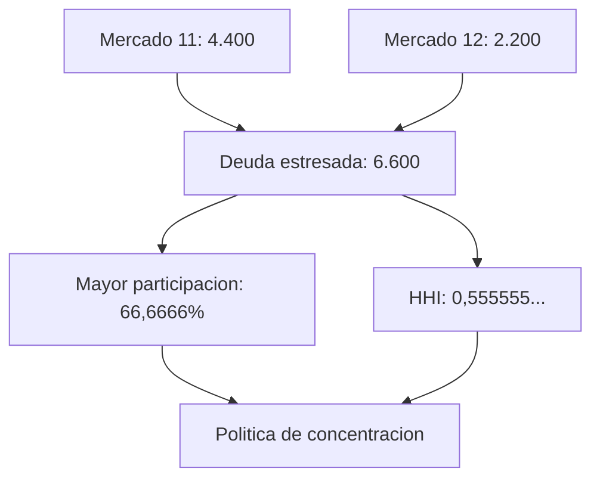
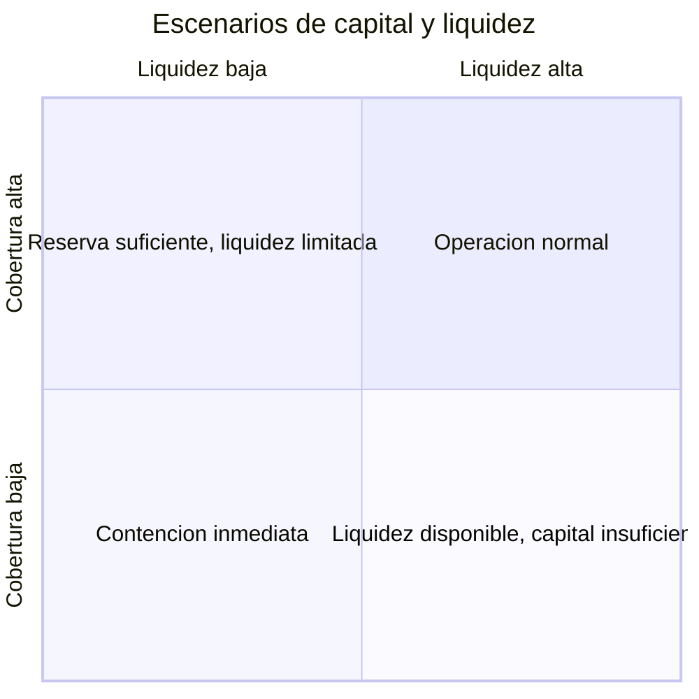

# Modelo Economico

## Alcance

El modelo combina solvencia de prestatarios, recuperacion de colateral, liquidez libre,
reservas, shocks y concentracion. Su salida es una decision reproducible; no sustituye
precios, contabilidad ni gobierno.

## Evaluacion Por Mercado



Formulas:

```text
SC = collateralValue * (1 - collateralShock)
SD = debtValue * (1 + debtShock)
LR = SC * liquidationThreshold * (1 - liquidationCost)
FL = max(suppliedLiquidity - totalDebt - reserveBalance, 0)
LL = FL * (1 - liquidityHaircut)
AC = LR + LL + reserveBalance
RC = ceil(SD * targetCoverage) + operationalBuffer
deficit = max(RC - AC, 0)
```

El redondeo de `RC` es hacia arriba. Los demas terminos se redondean hacia abajo para no
atribuir recuperacion o liquidez inexistente.

## Ejemplo Numerico

Entrada:

| Parametro             |  Valor |
| --------------------- | -----: |
| Liquidez suministrada | 10.000 |
| Deuda agregada        |  6.000 |
| Reservas              |    300 |
| Valor de colateral    |  7.000 |
| Valor de deuda        |  6.000 |
| Umbral                |    75% |
| Shock de colateral    |    20% |
| Shock de deuda        |    10% |
| Coste de liquidacion  |     8% |
| Haircut de liquidez   |    25% |
| Cobertura objetivo    |   115% |
| Buffer                |    100 |

Calculo:

```text
SC = 7,000 * 0.80 = 5,600
SD = 6,000 * 1.10 = 6,600
LR = 5,600 * 0.75 * 0.92 = 3,864
FL = 10,000 - 6,000 - 300 = 3,700
LL = 3,700 * 0.75 = 2,775
AC = 3,864 + 2,775 + 300 = 6,939
RC = 6,600 * 1.15 + 100 = 7,690
deficit = 7,690 - 6,939 = 751
```

El mercado conserva liquidez, pero no alcanza su objetivo de capital bajo el escenario.
La respuesta operativa puede combinar reduccion de caps, incremento de reservas o cambio
de exposicion; no debe inferirse una unica accion solo a partir del deficit.

## Concentracion

Para deuda estresada `d_i` y deuda total `D`:

```text
share_i = d_i / D
HHI = sum(share_i^2)
largestShare = max(share_i)
```



Un HHI alto puede existir aun cuando cada mercado tenga cobertura individual. Por eso la
decision de cartera exige capital y concentracion de forma separada.

## Vencimiento Ponderado

```text
weightedMaturity = sum(stressedDebt_i * maturitySeconds_i) / totalStressedDebt
```

La metrica aproxima la duracion operacional de la exposicion. Debe interpretarse junto a
la capacidad de repricing, disponibilidad de liquidadores y profundidad de mercado.

## Matriz De Escenarios



Escenarios recomendados:

| Escenario         | Colateral | Deuda | Liquidacion | Liquidez |
| ----------------- | --------: | ----: | ----------: | -------: |
| Base conservadora |      -10% |   +3% |          4% |      10% |
| Stress medio      |      -20% |  +10% |          8% |      25% |
| Stress severo     |      -35% |  +20% |         15% |      45% |

Los porcentajes se fijan por politica y se versionan con el bloque de entrada. No deben
calibrarse retroactivamente para mejorar una salida ya observada.

## Decision Operativa

Una cartera cumple el modelo cuando:

```text
totalDeficit == 0
largestMarketShare <= maximumMarketShare
debtHHI <= maximumHHI
```

Ademas, cada mercado informa si su liquidez sometida a haircut supera el minimo. Un
resultado agregado conforme no debe ocultar un mercado individual sin liquidez.

## Reconciliacion

Cada ejecucion del modelo debe conservar:

- bloque y `chainId`;
- inputs por mercado;
- politica completa;
- digest `keccak256` de inputs y politica;
- version de contrato y SDK;
- salida por mercado y agregada;
- identidad del proceso que adopto la decision.

El SDK implementa la misma aritmetica entera y la suite compara resultados exactos para
evitar divergencia entre operaciones y contrato.
