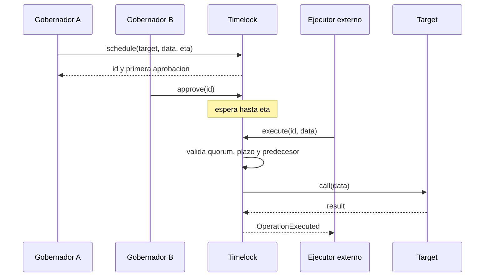
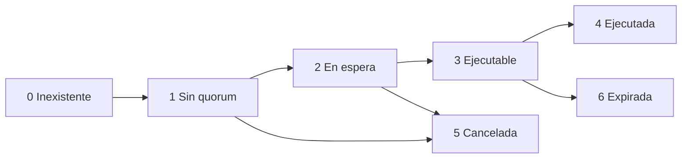

# Gobierno

## Modelo

`CipherGovernanceExecutor` aplica quorum, timelock, expiracion y dependencias. Una
operacion no se identifica solo por calldata: tambien liga cadena, instancia, target,
valor, politica temporal y predecesor.

```text
id = keccak256(abi.encode(
  OPERATION_DOMAIN,
  protocolDomain,
  chainId,
  executor,
  target,
  value,
  keccak256(data),
  predecessor,
  salt,
  eta,
  expiresAt
))
```

## Actores

| Actor             | Capacidad                                 |
| ----------------- | ----------------------------------------- |
| Gobernador activo | Programar, aprobar y cancelar             |
| Guardian          | Cancelar operaciones abiertas             |
| Ejecutor externo  | Ejecutar una operacion madura y aprobada  |
| Propio ejecutor   | Cambiar gobernadores, guardian y politica |

La ejecucion es permissionless una vez satisfechos todos los controles. Esto evita
depender de que una cuenta concreta permanezca disponible despues del timelock.

## Flujo



La primera aprobacion pertenece al proponente. Un gobernador no puede aprobar dos veces
el mismo identificador.

## Estados



Una operacion ejecutada o cancelada es terminal. Una operacion expirada no puede recibir
nuevas aprobaciones ni ejecutarse.

## Predecesores

El campo `predecessor` permite expresar cambios ordenados. Ejemplo:

1. transferir ownership de un componente al ejecutor;
2. aceptar ownership desde el ejecutor;
3. modificar parametros solo despues de la aceptacion.

La segunda operacion referencia el id de la primera. Aunque alcance quorum y madurez, su
ejecucion revierte hasta que el predecesor conste como ejecutado.

## Cambios De Politica

`setPolicy`, `setGuardian` y `setGovernor` usan `onlySelf`. Por tanto, cambiar el propio
control de gobierno exige programar y ejecutar una operacion normal.

Validaciones:

- quorum mayor que cero;
- quorum no superior al numero de gobernadores activos;
- ventana de gracia positiva;
- direcciones distintas de cero;
- no duplicar gobernadores;
- no retirar un gobernador si deja un quorum imposible.

## Politica Inicial Recomendada

| Parametro                   |         Valor inicial orientativo |
| --------------------------- | --------------------------------: |
| Gobernadores                |                             3 o 5 |
| Quorum                      |                         2/3 o 3/5 |
| Delay de cambios ordinarios |                          48 horas |
| Ventana de ejecucion        |                            5 dias |
| Guardian                    | Cuenta separada, solo cancelacion |

Los valores finales dependen de cadena, latencia de respuesta y capacidad de monitorizar.
Un delay inferior al tiempo de deteccion no ofrece una ventana operativa util.

## Checklist De Operacion

Antes de aprobar:

- recalcular el id de forma independiente;
- decodificar target, valor y calldata;
- verificar dominio, cadena, ejecutor, salt y predecesor;
- simular la llamada sobre el bloque previsto;
- comparar parametros antes/despues;
- confirmar que `eta` y expiracion coinciden con la propuesta.

Antes de ejecutar:

- verificar que no existe cancelacion;
- comprobar estado del predecesor;
- repetir la simulacion con estado reciente;
- verificar saldos si la llamada incluye valor;
- preparar observacion y contencion posterior.

## Eventos

Los indexadores deben consumir `OperationScheduled`, `OperationApproved`,
`OperationCancelled`, `OperationExecuted`, `GovernorUpdated`, `GuardianUpdated` y
`PolicyUpdated`. La fuente de verdad es el estado on-chain, no una cola externa.
