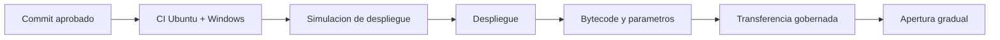
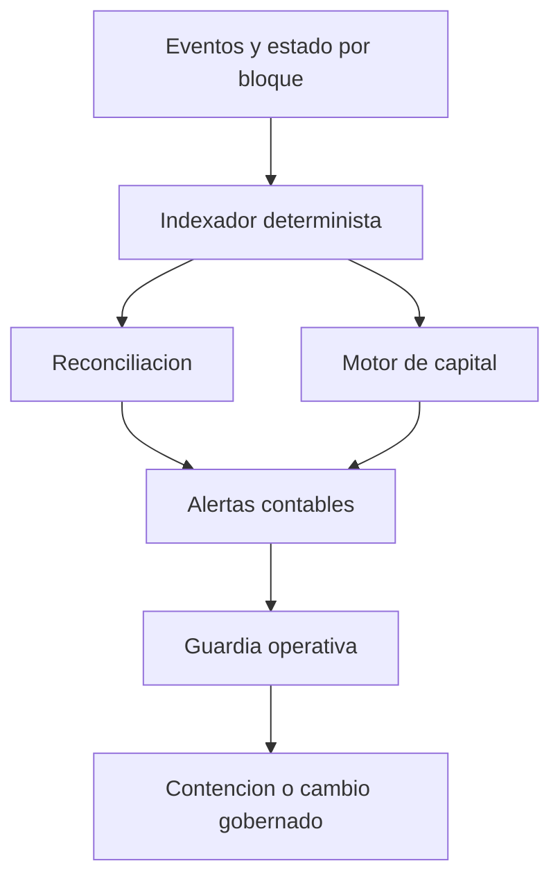

# Operaciones

## Objetivo

Este runbook define despliegue, observabilidad, cambios y respuesta para una instancia de
CipherDebtProtocol. Cada accion debe registrar cadena, direccion, bloque, commit y persona
responsable.

## Preparacion De Despliegue

1. ejecutar `npm ci` y `npm run ci`;
2. verificar el commit firmado o aprobado;
3. confirmar Solidity `0.8.24`, optimizer y `viaIR`;
4. fijar `chainId`, owner inicial, treasury y oracle;
5. documentar activos, decimales, caps y fuentes de precio;
6. simular la secuencia completa;
7. preparar verificacion de bytecode y ownership.



## Apertura Gradual

Orden recomendado:

1. suministro con cap reducido;
2. borrow con cap reducido;
3. repayment y retirada;
4. liquidacion con keeper observado;
5. migracion directa del prestatario;
6. migradores delegados;
7. caps operativos finales.

No abra dos fases en la misma operacion si eso impide atribuir una desviacion a un cambio
concreto.

## Metricas

Por mercado:

- liquidez suministrada, disponible y comprometida;
- deuda total, indice, tasa y reserva;
- utilizacion y variacion por ventana;
- concentracion por prestatario;
- deuda por bandas de salud;
- volumen de repayment, migracion y liquidacion;
- edad y estado del precio;
- proximidad a caps.

Por protocolo:

- deuda y colateral normalizados;
- cobertura bajo escenarios base, medio y severo;
- deficit, HHI y mayor participacion;
- operaciones de gobierno por estado;
- llamadas revertidas por tipo de control.



## Alertas

| Señal                  |           Umbral inicial | Respuesta                  |
| ---------------------- | -----------------------: | -------------------------- |
| Oracle sin vigencia    | Cualquier mercado activo | Pausar nuevas exposiciones |
| Utilizacion            |                    > 90% | Revisar cap y liquidez     |
| Salud                  |             Posicion < 1 | Verificar liquidacion      |
| Capital                |              Deficit > 0 | Contencion por mercado     |
| Concentracion          |        Fuera de politica | Limitar crecimiento        |
| Referencias de release |             SHA distinto | Bloquear publicacion       |

Los umbrales deben versionarse. Una alerta no debe mutar automaticamente parametros de
riesgo salvo que exista una politica explicitamente gobernada y probada.

## Reconciliacion

En cada bloque relevante:

```text
suppliedLiquidity
- assets withdrawn by suppliers
- active debt principal at market index
- reserve balance
= economically attributable token balance
```

La igualdad concreta depende del tratamiento de intereses y recibos. El reconciliador
debe usar los mismos redondeos del contrato y reportar cada residual con su origen.

Para migraciones registre ambos mercados en una sola unidad de trabajo. Para
liquidaciones registre deuda pagada, colateral transferido y estado residual.

## Respuesta A Incidentes

1. preservar bloque, logs, estado y configuracion;
2. clasificar el flujo afectado;
3. limitar crecimiento mediante pausa o cap;
4. comprobar posiciones y agregados relacionados;
5. preparar una reproduccion local;
6. revisar una medida temporal y una correccion permanente;
7. ejecutar cambios mediante gobierno;
8. verificar reconciliacion antes de reabrir.

La pausa de repayment puede perjudicar recuperacion; no debe aplicarse por defecto cuando
el flujo de entrada de activos sigue siendo seguro.

## Rollback

Los contratos no asumen upgrade automatico. Un rollback operativo consiste en revertir
parametros mediante una nueva operacion o mantener flujos pausados mientras se coordina
una migracion. Nunca se debe forzar una referencia Git hacia un commit no validado para
simular una reversión.

## Cierre De Release

Una entrega queda cerrada cuando:

- PR fusionado y CI de `main` verde;
- `production` apunta al mismo SHA y tiene CI verde;
- tag anotado apunta al mismo objeto;
- release `Production 1.0.0` publicada;
- workflow de integridad de release verde;
- documentacion y hashes registrados;
- clon operativo limpio y sin material privado versionado.
