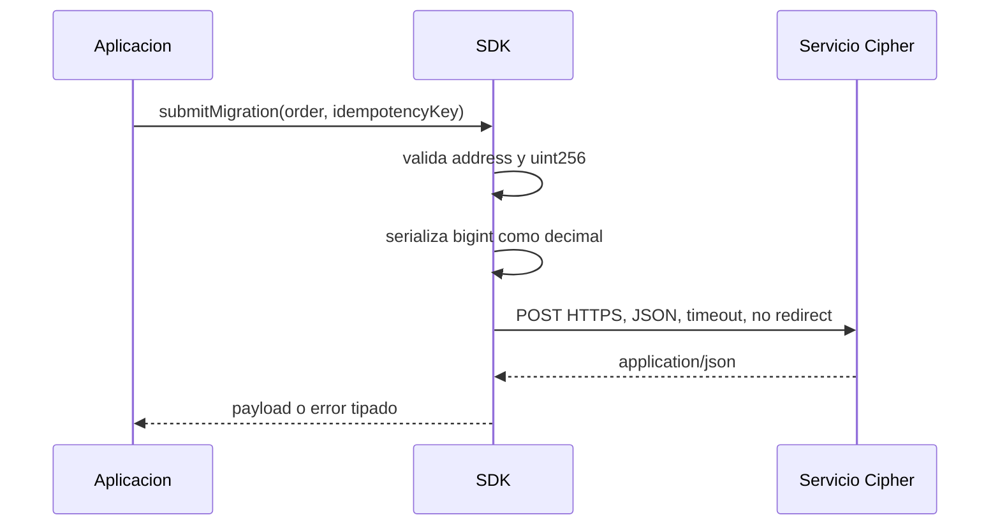

# SDK JavaScript

## Alcance

`sdk/cipherDebtClient.js` ofrece utilidades deterministas y un cliente HTTP pequeño. No
firma transacciones ni custodia claves. La aplicacion integradora decide como firma,
simula y transmite una orden.

## Importacion

```javascript
const {
    CipherDebtClient,
    MIGRATION_ORDER_TYPES,
    WAD,
    assessMarket,
    assessPortfolio,
    buildMigrationOrder,
} = require("./sdk/cipherDebtClient");
```

Todos los importes economicos se reciben como `bigint` o cadenas enteras. Las respuestas
del constructor de orden se serializan como cadenas decimales para conservar `uint256`.

## Cliente

```javascript
const client = new CipherDebtClient({
    baseUrl: "https://api.cipher.example",
    fetchImpl: globalThis.fetch,
    bearerToken: process.env.CIPHER_API_TOKEN,
    timeoutMs: 8_000,
});
```

Controles:

- HTTPS obligatorio fuera de `localhost`, `127.0.0.1` y `::1`;
- `fetch` inyectable para pruebas;
- timeout mediante `AbortController`;
- redirects deshabilitados;
- `Accept` y `Content-Type` JSON;
- bearer token opcional;
- idempotencia obligatoria en envio de migracion;
- error ante respuesta no JSON.



## Construccion De Orden

```javascript
const order = buildMigrationOrder({
    borrower: "0x1111111111111111111111111111111111111111",
    sourceMarketId: 4n,
    destinationMarketId: 8n,
    debtAmount: 125n * WAD,
    collateralAmount: 250n * WAD,
    destinationIndexSnapshot: 1_025_000_000_000_000_000n,
    minHealthFactor: WAD,
    deadline: 2_000_000_000n,
    nonce: 44n,
});
```

La salida esta congelada con `Object.freeze`. `MIGRATION_ORDER_TYPES` expone el orden de
campos compatible con EIP-712. La aplicacion debe añadir el dominio adecuado a su cadena y
contrato antes de solicitar firma.

## Previews

```javascript
const market = await client.market(4n);
const position = await client.position(4n, "0x1111111111111111111111111111111111111111");
const preview = await client.previewMigration(order);
```

Una preview es informativa y esta ligada al estado consultado. Antes de firmar o enviar,
compare bloque, deadline, nonce, indices, salud y slippage definidos por la aplicacion.

## Idempotencia

```javascript
await client.submitMigration(order, "account-42-order-000044");
```

La clave debe tener al menos 16 caracteres. El servicio debe conservar la asociacion
entre clave, identidad autenticada y cuerpo canonico. Reutilizar una clave con otro cuerpo
debe rechazarse.

## Modelo De Capital Offline

```javascript
const assessment = assessPortfolio(markets, {
    targetCoverageWad: 1_150_000_000_000_000_000n,
    operationalBuffer: 100n * WAD,
    minimumLiquidLiquidity: 500n * WAD,
    maximumMarketShareWad: 700_000_000_000_000_000n,
    maximumHhiWad: 600_000_000_000_000_000n,
});
```

El algoritmo mantiene paridad con `CipherCapitalEngine`: mismos floors, ceilings, HHI y
vencimiento ponderado. La suite compara valores exactos, no aproximaciones de coma
flotante.

## Errores

| Condicion                | Tipo                          |
| ------------------------ | ----------------------------- |
| Valor no entero          | `TypeError`                   |
| Valor fuera de `uint256` | `RangeError`                  |
| Ratio mayor que WAD      | `RangeError`                  |
| Address no valida        | `TypeError`                   |
| Endpoint remoto HTTP     | `TypeError`                   |
| Timeout                  | `AbortError` de fetch         |
| Respuesta no JSON        | `Error`                       |
| HTTP no satisfactorio    | `Error` con `status` y `code` |

No registre bearer tokens ni cuerpos que contengan datos sensibles. En trazas operativas,
use hashes de orden y direcciones cuando sean necesarias para reconciliacion.

## Pruebas

```bash
npm run test:node
```

Las pruebas cubren aritmetica, paridad del modelo, HHI, ordenes, transporte seguro,
idempotencia, autenticacion, contenido y artefactos del repositorio.
