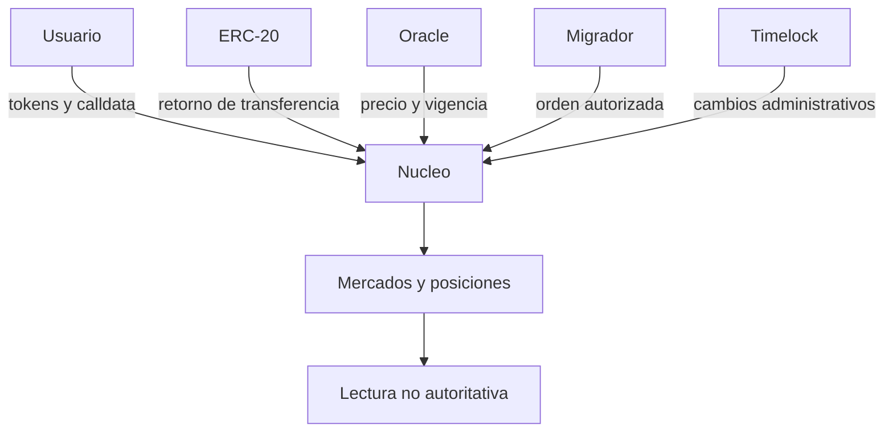
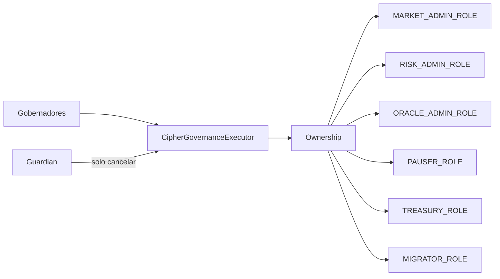

# Modelo De Seguridad

## Activos Protegidos

- tokens suministrados por proveedores;
- colateral depositado por prestatarios;
- deuda y reservas atribuibles a cada mercado;
- permisos administrativos y de migracion;
- integridad de precios, indices y parametros;
- operaciones de gobierno y referencias de release.

## Supuestos

- Los ERC-20 configurados cumplen la interfaz esperada y su precision esta documentada.
- El oracle entrega precio, timestamp y estado validables.
- Los roles administrativos estan bajo cuentas controladas y separadas.
- Los indexadores no sustituyen la fuente de verdad on-chain.
- Los operadores verifican bytecode, cadena y direcciones antes de actuar.

## Limites

Toda entrada externa se valida de nuevo en el nucleo. El hecho de que una interfaz o API
muestre una operacion como valida no concede autoridad on-chain.

## Amenazas Y Controles

| Amenaza                           | Control principal                     | Evidencia            |
| --------------------------------- | ------------------------------------- | -------------------- |
| Reentrada durante transferencias  | Guardia y checks-effects-interactions | Pruebas de flujos    |
| Precio obsoleto o pausado         | Vigencia y estado del oracle          | Lecturas y eventos   |
| Sobreendeudamiento                | Factor de colateral, salud y caps     | Estado posterior     |
| Residuo de deuda                  | `minDebt`                             | Reversion especifica |
| Reuso de orden                    | `actionId` y `consumedOrders`         | Mapping y evento     |
| Caller de migracion no autorizado | borrower, aprobacion o rol            | Mapping de permisos  |
| Cambio administrativo unilateral  | Quorum y timelock                     | Operacion canonica   |
| Ejecucion fuera de ventana        | `eta` y `expiresAt`                   | Estado de gobierno   |
| Concentracion excesiva            | mayor share y HHI                     | Motor de capital     |
| Divergencia SDK/contrato          | aritmetica bigint y paridad           | Suite Node/Solidity  |
| Referencias de entrega distintas  | workflow de integridad                | GitHub Actions       |

## Privilegios

La configuracion recomendada transfiere ownership al ejecutor despues de validar la
instancia. El guardian no puede ejecutar ni reconfigurar; solo cancela operaciones
abiertas.

## Propiedades Por Flujo

### Supply Y Retirada

- el recibo representa el importe suministrado;
- la retirada no supera balance de recibo ni liquidez disponible;
- el activo se transfiere solo despues de actualizar estado.

### Borrow Y Repayment

- el indice se acumula antes del cambio;
- borrow respeta liquidez, cap, suelo y salud;
- repayment no supera deuda actual;
- deuda de posicion y agregado cambian por el mismo pago.

### Colateral Y Liquidacion

- una retirada conserva salud minima;
- liquidacion requiere salud inferior a WAD;
- colateral incautado se limita al disponible;
- el bonus se aplica con precios validados.

### Migracion

- mercados diferentes y colateral compatible;
- caller autorizado;
- deadline y nonce validos;
- orden consumida una sola vez;
- ambos indices acumulados;
- caps, suelo y salud comprobados en destino y origen.

### Gobierno

- identidad ligada a cadena e instancia;
- aprobaciones unicas;
- quorum alcanzado antes de ejecutar;
- delay y ventana aplicados;
- predecesor ejecutado;
- calldata y valor coinciden con lo programado.

## Validacion

La suite publica combina:

- integracion de mercados y posiciones;
- modelos de capital y concentracion;
- gobierno, quorum, delay, predecesor y cancelacion;
- SDK y aritmetica exacta;
- inventario documental y artefactos;
- CI en Ubuntu y Windows;
- integridad de rama, tag y release.

Los resultados de CI no sustituyen una revision del despliegue. Direcciones, bytecode,
roles, parametros, precios y saldos deben verificarse en la cadena objetivo.
